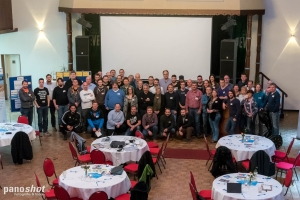

# Contao Camp 2017

## Info:
Das Camp fand in Jever am 11. und 12. November 2017 [im Schützenhof](https://www.schuetzenhof-jever.de/) statt. Wir hatten etwa 62 Teilnehmer.

Link zur Webseite: https://2017.camp.contao.org/

[Rückblick der Küstenschmiede](https://kuestenplanet.de/artikel/r%C3%BCckblick-contao-camp-2017)

## Sessions:
Es folgt eine Auflistung der Sessions und deren Themen. Die Namen geben den
„Moderator“ der Session wieder, d.h. derjenige der entweder die Session
vorgeschlagen oder sich bereit erklärt hat, zu dem Thema was zu sagen/machen.

## Samstag, 11.11.2017

### Titel

* Punkt 1
* Punkt 2
* Punkt 3

## Sonntag, 12.11.2017

### Titel

* Punkt 1
* Punkt 2
* Punkt 3
