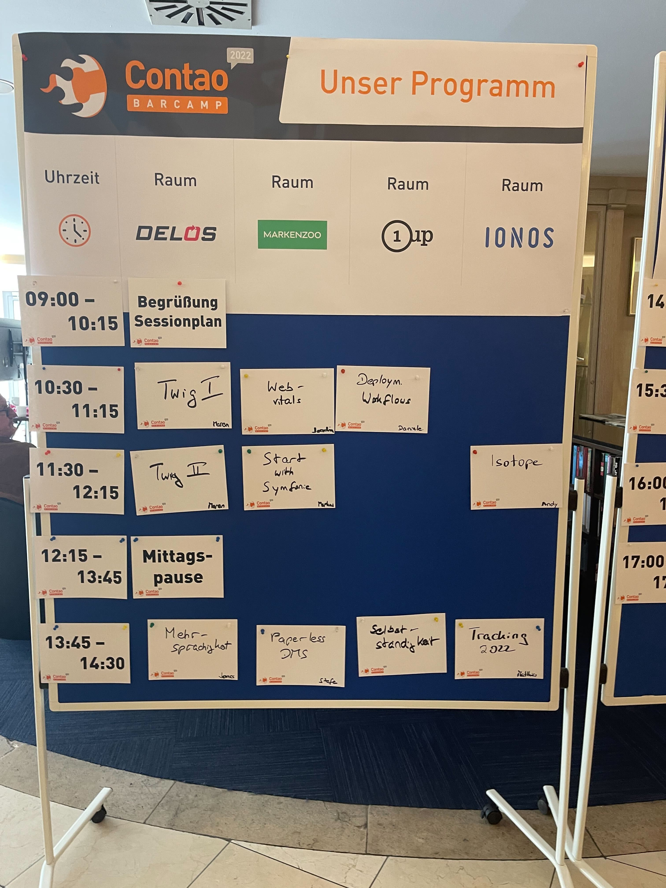
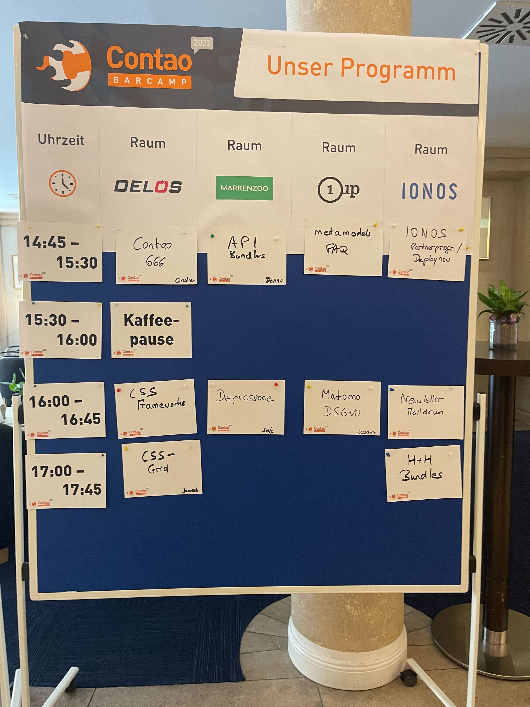

# Contao Camp 2022

## Info:
Das Camp fand in Potsdam am 29.04. und 01.05.2022 statt. Wir hatten etwa 60 Teilnehmer.

Link zur Webseite: https://2022.camp.contao.org/

## Sessions:
Es folgt eine Auflistung der Sessions und deren Themen. Die Namen geben den
„Moderator“ der Session wieder, d.h. derjenige der entweder die Session
vorgeschlagen oder sich bereit erklärt hat, zu dem Thema was zu sagen/machen.

### Samstag, 29.04.2022

#### Twig I (Dr. Maren Lange)

#### Web Vitals (Joachim ?)

#### Deployment/Workflows (Daniele ?)

#### Twig II (Dr. Maren Lange / Moritz Vondano)

#### Start mit Symfony (Markus ?)

#### Wie geht Isotope? (Andreas Schempp)

#### Mehrsprachigkeit (Jonas ?)

#### Paperless DMS (Stefen ?)

#### Selbständigkeit (Ingolf Steinhardt)

#### Tracking 2022 (Matthias ?)

#### "Gott, Satan, Contao & die Außenwirkung" [Contao 666] (Christian Barkowsky)

#### API Bundles (Dennis ?)

#### MetaModels FAQ (Ingolf Steinhardt)

#### IONOS Partnerprogramm/Deploy-Now (Roman Okon)

#### CSS Frameworks ()

#### Depressionen (N.N.)

#### Matomo & DSGVO (Joachim Nickel)

#### Newsletter-Erweiterung "Maildrum" (? ?)

#### CSS-Grid (Janosch Oltmanns)

#### H+H Bundles (Pitt Roscher)

### Sonntag, 01.05.2022

#### Frontend Testing (Ralf Baussenwein)

#### Agentur-Tools (Matthias ?)

#### Unbekannte Extension-Perlen (Ingolf Steinhardt)

#### Twig Dev (Moritz Vondano)

#### Contao 4.13 (Christian Fenneberg / Andreas Schempp)

#### Energiesparende Weibseiten (Mathias Arzberger)

#### Hochverfügbarkeit/Cluster (Stefan ?)

#### Quo vadis dlh_googlemap? (Christian de la Haye)

#### Einstieg Bundleentwicklung (Moritz Vondano)

#### Backup Contao (Janosch Oltmanns)

#### IONOS Partnerprogramm/Deploy-Now II (Roman Okon)

#### Contao Performance & Dev (Florian ?)

#### "Gott, Satan, Contao & die Außenwirkung" II [Contao 667] (Christian Barkowsky)

#### Delos & Contao  (Janosch Oltmanns)

#### Yoga (Lara & Linus)
