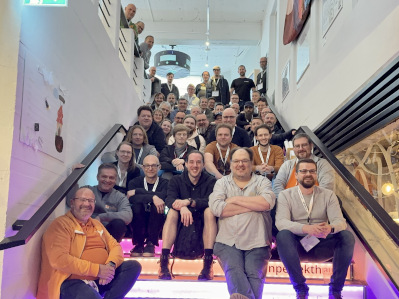

# Contao Camp 2024

## Info:

Das Camp fand in Essen am 20. und 21.04.2024 im [Unperfekthaus](https://www.uph.de/) statt. Wir hatten etwa 50 Teilnehmer.

https://2024.camp.contao.org

## Sessions:
Es folgt eine Auflistung der Sessions und deren Themen. Die Namen geben den
„Moderator“ der Session wieder, d. h. derjenige der entweder die Session
vorgeschlagen oder sich bereit erklärt hat, zu dem Thema was zu sagen/machen.

## Samstag, 20.04.2024

[Plan 1](2024_plan_tag1.jpg)

### Twig [Jerome Wein]

- wie PHP in Twig migrieren
- Twig Filter anlegen, wo und wie
- eigene Twig Templates anlegen
- Twig Ordnerstruktur
- benötigte Blöcke herausfinden (GitHub/vendor)
- Bugfixing & Debug-Mode
- Idee für Referenz oder Verlinkung bei Generierung von neuem Template, als Link zu GitHub oder vielleicht
  sogar mit so einer Art Preview-Mode
- Phpstorm ai PHP zu Twig

### Barrierefreiheit (FE) [Joachim Nickel]

- man muss nicht 2025 Barrierearm mit seiner Webseite sein, aber bei "grundlegenden Änderungen" oder Kontaktformular
  usw. hat man entsprechende Verpflichtung
- "Barriere-Frei" geht per se nicht bei Webseiten - eher "barrierereduziert" verwenden
- Accessibility-Tools sind eher mit Vorsicht zu geniessen - die Ladezeit geht in den Keller und der User muss erstmal
  die Einstellung vornehmen
- Aria-Attribute: sind wichtig, müssen aber stimmen! - ansonsten "verschlimmbessern" eher die Seite
- Klassifizierung nach A/AA/AAA - AA sollte mindestens erreicht werden
- es gibt spezielle Media-Queries für das Thema - eine Aufstellung machen Joachim und Ingolf für das Handbuch
- "Barriere-Check" anhand der Contao-Demo besprochen
- Webseite sollte von vornherein kontrastreich gestaltet werden - ohne das "dunkles Grau auf hellem Grau..."
- Einfache Sprache: wie findet jemand die Umschaltung bzw. den Seitenzweig
- Unterscheidung zwischen "Leichte Sprache" vs. "Einfache Sprache" - siehe https://www.inklusion-kultur.de/infoportal/kommunikation-information/leichte-und-einfache-sprache/
- Testen z. B. [WAVE Web Accessibility Evaluation Tools](https://wave.webaim.org/) als Browser-Tool - bestes "Tool" ist
  jemand, der die entsprechende Einschränkung hat
  auch https://www.experte.de/barrierefreiheit, https://polypane.app/ oder
  Mobilapp https://play.google.com/store/apps/details?id=asada0.android.cvsimulator / https://apps.apple.com/us/app/chromatic-vision-simulator/id389310222,
  https://apps.apple.com/us/app/chromatic-vision-simulator/id389310222
  https://chromewebstore.google.com/detail/visbug/cdockenadnadldjbbgcallicgledbeoc?pli=1 / https://addons.mozilla.org/de/firefox/addon/visbug/
- Selbstbewertung BITV https://bitvtest.de/tests-und-beratung/selbst-testen/bitv-selbstbewertung
- Webseite mit Tab-Taste testen
- Barrierereduzierung und SEO ergänzen sicht oft
- Wunsch wäre, dass Contao-Core-Elemente die Aria-Auszeichnungen richtig ausgibt
- Beispielseite mit Individualimplementierung https://access-for-all.ch/ - ggf. als Erweiterung machbar

### Versionsverwaltung [Jan Friebe]

- Wie gehe ich besten mit meiner Code-Versionierung um, damit ich später auch noch etwas wiederfinde?
- siehe Präsentationsfolien [github-repo](https://github.com/friebe/building-blocks-presentation)
  oder [hier](./folien-versionsverwaltung-friebe.pdf) 

### Barrierefreiheitsstärkungsgesetz [Benedict Massolle, Joachim Nickel]

- Gesetz: https://www.bmas.de/DE/Service/Gesetze-und-Gesetzesvorhaben/barrierefreiheitsstaerkungsgesetz.html
- Zusammenfassung: https://www.verdure.de/magazin/strategie/barrierefreiheitsstarkungsgesetz-websites-2025-bfsg-bitv-wcag/
- siehe auch zum Thema "Zumutbarkeit" https://de.wikipedia.org/wiki/Zumutbarkeit
- Kunden auf Frist hinweisen und dokumentieren um keine "Angriffsfläche" für juristische Auseinandersetzungen zu haben

### Updates [Alex Wuttke]

### Modernes CSS [Janosch Oltmanns]

### Contao.Contact [Stefan Lindecke]

- Dienst contao.contact vorgestellt und Intention am Beispiel [lindesbs.contao.contact](https://lindesbs.contao.contact) erklärt.
- Bundle ist frei verfügbar
- Einbindung der VCF und QRCode Generierung über weiteres Paket vorgesehen (https://github.com/lindesbs/MemberQRCode);
  dieses wird noch erweitert durch ContentElemenete/Module für die Einzel und Mehrfachgenerierung von VCF/QRCode

### Matomo [Joachim Nickel]

- Vortrag von Joachim in "Kurzdurchlauf"
- "Fünfzig Prozent des Werbebudgets sind raus geworfenes Geld" (Henry Ford)
- Wie ist Werbung messbar? Mit Zeitung, Radio, Fernseher - ist das nicht machbar... => Gießkannenprinzip.
- Kanäle: Anzeigen/Ads, E-Mails/Newsletter, Webseite?
- Kosten für: Inhalte, Anzeigenplätze
- Verbindung zwischen Werbekosten zu Käufen per Analytics - wie gut ist Analytics?
- Analytics ist so gut, wie man es konfiguriert - die Interaktionen müssen passend gemessen werden
- Tracking-Links in normale E-Mails einbauen (kein Personenbezug einbauen)
- Auswertung in Matomo per "Kombiniertes Reporting"
- "Trüffel-Tipps":
  - Kampagnen-Parameter kürzen (z. B. yourls.org)
  - Kampagnen-Parameter mtm_* und utm_* werden entfernt - daher eigene Parameter verwenden (in Matomo konfigurierbar)
  - Datenverlust in Analytics beheben - Matomo kann Consent-Bannerfrei eingesetzt werden / Adblocker können umgangen
    werden (siehe Blockliste z. B. uBlock Origin)
  - Ladezeit beachten - erst nach vollständigem Laden, wird Matomo-Track befeuert
  - Tracking von Bildschirmauflösung und Browsererweiterungen abschalten, damit kein Fingerprinting erfolgt
- Tipp: Matomo auf eigenem Server
- Neues Reporting-Tool für Matomo-Daten in Vorbereitung

### Starter-Kit [Stefan Fischer]

### Versionsverwaltung Code/Deployment [Sascha Wustmann]

- Viele verschiedene Möglichkeiten
- Einfache Systemupdates über den Manager oder Trakked
- Deployment vom lokalen Rechner mittel Phing, MagePHP, Deployer o.ä.
- Integration von Tools in Deployment Systeme (Gitlab CI, Jenkins o.ä.)

### Agenturtools [Ali Dursun]

- Kommunikation / Datei-Share
  - Libre Workspace
  - Nextcloud
  - SeaFile
- Projekte / Aufgaben
  - aWork
  - Redmine
  - Trello
  - Clickup
  - Moco
- Zeiterfassung
  - Clockodo
- Wiki / Doku
  - Xwiki
  - Wiki.js
  - Bookstack
  - Gitlab
- Automatisierung
  - zapier
  - make
  - n8n.io
- Fernwartung
  - Rustdesk
  - HoptoDesk
- Monitoring
  - Uptime Kuma
  - Icinga
  - StatusCake
- Backup
  - Monkey für Joomla / Wordpress

(Verlinkungen folgen...)

### Core-Contributions [Leo Feyer]

- Verschiedene Wege, das Monorepo in eine Managed-Edition einzubinden, um Änderungen im Browser testen zu
  können: Symlink über Composer oder direkte Entwicklung in `vendor`.
- Eigenen Fork erstellen und als Remote hinzufügen.
- Pull-Request auf github.com erstellen.
- Installation bzw. Aktivierung von Yarn 4, um die Assets zu builden.

### zod.js Schema-Verwaltung [Jan Friebe]

- leider bestand hier kein Interesse und die Session ist nicht zustande gekommen.
- Wen das Thema (TypeScript-first schema validation with static type inference) trotzdem interessiert, kann sich
  unter folgendem Link informationen einholen [zod.js](https://zod.dev/)

### Zusammenfassung [Janosch Oltmanns]

## Sonntag, 21.04.2024

[Plan 2](2024_plan_tag2.jpg)

### Einsatz von KI [Christian Röckl]

- An welchen Stellen unseres Auftragsablaufes kann KI eingesetz werden?
- Unterstützung bei Kommunikation wie E-Mails (Chrome-Erweiterung)
- Zusammenfassung von Texten wie Vertäge
- Texterstellung - Achtung: Texte checken!; z. B. Produktbeschreibung
- Generierung von Sitemap als Grafik z. B. [Octopus](https://octopus.do/)
- Wireframe generieren z. B. [Relume](https://www.relume.io/)
- Generierung von Bildern, erweitern von Bildern z. B. bei unpassenden Formaten, Icons (z. B. Indesign)
- Generierung von JS Snippets
- SEO z. B. Zusammenfassungen/Description, Alt-Texte von Bildern
- Marketing
- Überwachung von Websitesinhalten
- Präsentationen z. B. mit [Gamma.app](https://gamma.app/), Video generieren
- [Harpa Ai](https://chromewebstore.google.com/detail/harpa-ai-automatisierungs/eanggfilgoajaocelnaflolkadkeghjp?)
- aus Screenshot bearbeitbare Seite machen [Uizard](https://uizard.io/)
- Chatbot - aktuell die Unterschiede in der Handhabung bei der Konfiguration

Tools:

- https://www.chatbase.co/
- https://www.relume.io/
- https://www.voiceflow.com/
- https://harpa.ai/
- https://gamma.app/
- https://www.kamoto.ai/
- https://www.heygen.com/
- https://poe.com/explore?category=Official
- https://uizard.io/
- https://huggingface.co/
- https://chat.lmsys.org/ --> LLM Testseite

### Contao Events / Themen für Konferenz 2024 [Stefan Preiss, Markus Peltzer]

Angestoßen wurde die Session vom Event-Team und rund 15 Personen besuchten die Session

**Im ersten Teil der Session wurde das Format Barcamp thematisiert.**  
Sowohl in der Contao Community als auch in anderen Communities sind die Besucherzahlen zu Camps rückläufig. Das
mag noch an Auswirkungen der Pandemie liegen, es wurde auch diskutiert, dass das Format als solches nach 15 Jahren
an Attraktivität verloren hat.

Zur Frage, ob das Format besser in der Woche oder am Wochenende stattfinden sollte, gab es unterschiedliche Meinungen:
- für Einzelkämpfer besser am Wochenende
- für Angestellte, die zu Veranstaltungen geschickt werden, ist es während der Woche besser

Vorteile des Formats Barcamp:
- Möglichkeit, viel und in Kommunikation zu lernen
- individueller Know-How Transfer möglich
- geringerer Ticketpreis
- Fokus auf Community/Netzwerken

Spezielle Nachteile des Formates Barcamp:
- das Format lässt sich Chefs schwieriger vermitteln, da unklare Inhalte

Allgemeiner Nachteil der Veranstaltungen:
- zusätzliche Belastung durch Hotel, Anfahrt etc durch Preissteigerungen

Ideen für das Camp:
- denkbar wäre eine Terminierung Freitag/Samstag
- Themenpunkte des letzten Camps auf Website(s) veröffentlichen
- Mischformate (vorgegebene Themengruppen)
- Kombination mit Colleges
- Kombination mit anderen CMS
- Banner der Veranstaltung auch in der Doku

Fragerunde, wie Besucher vom Camp erfahren haben:
- Slack, explizite Ansprache
- Idee, die nächste Veranstaltung im Anschluss zu verkünden (ist in Kiel/Camp 2024 passiert)
- nicht anwesende Personen anschrieben

Alternative Formate zum Camp:
- Mix-Events
- Sommerfest mit Workshops
- Fuckup-Night im Abendprogramm

**Im zweiten Teil der Session wurde das Format Konferenz thematisiert.**  
Wie beim Camp auch gibt es rückläufige Besucherzahlen in allen Communities. Besprochen wurde die Zielgruppe und
mit welchen Motivationen Besuchergruppen haben:
- Lowpreis vs. Highpreis
  - Lowpreis/Einsteiger: weniger Vor-Ort für Angestellte, viel Online
  - Highpreis: Agenturen/Firmen schicken die "Head-Ofs" (mehr Budget)

Konsens herrschte bei der These, dass Online-Formate eine Konkurrenz wurden. Diese wurden durch Corona
professionalisiert und bringen weniger Arbeitszeitausfall und weniger Kosten mit sich.

Weitere Ideen/Themen zur Konferenz:
- bezahlte Anzeigen (CA-Budget nutzen)
- Idee: in SoMe-active Nutzer als Influencer nutzen
- Wie können Agenturen erreicht werden?
- explizite Themenstränge beibehalten
- Bedürfnisse/Wünsche abfragen
- Speaker-Suche ist aufwändig/müßig
- finanziell werden Speaker aus der Community benötigt
- Meta-Themen: Mitarbeiterführung, Projektleitung
- Security-Themen
- Symfony Community

Weitere Topics
- brauchen wir neue/weitere Online-Formate
- offene Online-Stammtische

### Blick in die Zukunft und über den Tellerrand hinaus [Benedict Massolle, Christian  Röckl]

Nennenswerte Unterschiede von Contao zu anderen Redaktionssystemen, die im Arbeitsalltag oder im Gespräch mit Kunden
auftauchen:
- Andere CMS bieten eine API
- Inhalte in Contao sind sehr verschachtelt (immer Seiten, Artikel, Inhaltselemente), andere CMS sind da flacher
- Schulungsbedarf bei Contao
- Das CMS muss zum Job passen: Je nach Anforderungsprofil des Jobs ist der Aufwand höher auch geringer. Auch die
  Verfügbarkeit von Erweiterungen spielt eine Rolle
- Contao hat ein komplexes Rechtemanagement: Es lässt sich sehr viel sehr fein einstellen, man muss sich 
  aber auch damit auseinandersetzen.
- Weniger Features des CMS erlauben manchmal mehr Kontrolle. Gegen manche Contao-Features muss man regelrecht ankämpfen.

Es haben sich unterschiedliche Herangehensweisen herauskristallisiert: Alles über das Backend steuern vs.
alles „im Template hardcodieren“. Je nach Arbeitsweise passt ein CMS, besser als das andere. Die eierlegende
Wollmilchsau wird es eher nicht geben.

Andere CMS, die in der Contao Community je nach Anforderung auch verwendet werden: 

- [Kirby](https://getkirby.com)
- [Processwire](https://processwire.com/)
- [Craft CMS](https://www.craftcms.de)
- [Typo 3](https://typo3.org/)
- [Joomla](https://joomla.org)
- [Wordpress](https://wordpress.org).

### Wie geht: Trakked [Bjarke Ammann]

- Registrierung
- Einbindung
- Tracking von Seiten
- Security-Hinweise

### Finanzierung von Erweiterungen [Andreas Schemp]

- es wurden verschiedene Wege für Refinanzierung erörtert
- "early-adopter-programm" wie bei MetaModels, Contao-Bootstrap, Include-Erweiterung - also mit Programmierung in 
  Vorleistung gehen und einen finanziellen Beitrag für sofortige Nutzung bekommen; Ingolf hat im Vorfeld zu "EAP" eine
  Umfrage bei Agenturen gemacht und das ist für viele eine gute Option für die Projektplanung; bei dem "EAP" sind die
  Erweiterung nach Finanzierung für alle frei verfügbar
- klassisches Fundraising like Kickstarter - wenig Bereitschaft im DACH-Bereich für diese Variante der Finanzierung
- Klassische Bezahlvariante - ggf. vorhandene Lizenzbedingungen beachten
- eigene "Community" wie bei Isotope mit dem "Circle" - da reichen Einnahmen nur für Bugfixes/Support aber nicht für
  große Neuentwicklungen/Features
- Variante mit freier Verfügbarkeit und zu bezahlenden Plugins
- schwierig ist die Umstellung von bisherigen kostenlosen Varianten zu einer Bezahlvariante

### Tools für Coding [Stefan Lindecke]

- Abklärung, was inhaltlich gemeint ist.
- Es existieren Tools/Plugins für Console/PHPStorm, die einem die Grundlagen abnehmen, wie z. B.:
  - SkeletonBundle (https://github.com/contao/skeleton-bundle)
  - ContaoMakerBundle (https://github.com/contao/maker-bundle)
- Spezielle Plugins für Contao existieren bisher nicht, Wunsch war z.B. DCA Struktur Unterstützung, 
  _File->New_ mit ContentElements/Modules etc.
- Allgemein bekannte Plugins (https://plugins.jetbrains.com/plugin/7219-symfony-support)

Finale Besprechung bezüglich Tools zum Entwickeln mit Docker, plain oder ddev (https://ddev.com/)

### Contao ThemeManager [Daniele Sciannimanica]

- Historie 
- Warum gibt es den ThemeManager und wie ist er entstanden
- Bestandteile des [ThemeManagers](https://www.contao-thememanager.com/)
- Core Features wie Seo-Headlines & Hintergrundbilder
- Arbeiten mit dem ThemeManager
- [Dokumentation](https://contao-thememanager.github.io/docs/pages/docs/introduction/)
- Wie installiere ich [erwerbbare Themes](https://www.contao-thememanager.com/shop/themes)
- Fragen & Antworten

### Contao Xliff [Christian Bargon, Ingolf Steinhardt]

- Unterschiede zwischen Xliff 1 und 2
- Vorstellung von "[Contao2Xliff](https://www.contao2xliff.de/)"
  - Duplizieren des Seitenbaums
  - Zielgruppe ist "normale Contao-User"
- Vorstellung von "[XLIFF-Ex-Import](https://metamodels.readthedocs.io/de/latest/manual/extended/xliff_ex-import.html)":
  - Konsolen-Tool
  - Steuerung über eine Konfigdatei
  - Automatisierung per Cronjob möglich
  - Debugmöglichkeiten bei z. B. bei unklaren Zuordnungen
  - Zielgruppe ist eher Admins, die automatisierte Export/Importe einrichten wollen oder MetaModels dabei haben
- bei beiden muss man bei Erweiterungen gucken, was geht

### "Matomo+" - Tracking bei Contao-Seite [Joachim Nickel]

### Code-Quality [Florian Otto]

### Ideen für Contao-Bundles [René Fehrmann]
