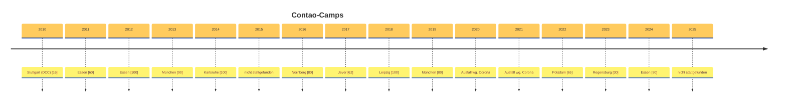

# Contao Camps

**Zusammenfassung der Contao-Camps**

* 2026 - in Planung...
* 2025 - Camp hat nicht stattgefunden
* [2024 - Essen](2024/camp-2024.md)
* [2023 - Regensburg](2023/camp-2023.md)
* [2022 - Potsdam](2022/camp-2022.md)
* 2021 - Camp hat nicht stattgefunden (Corona)
* 2020 - Hamburg - Ausfall wg. Corona
* [2019 - München](2019/camp-2019.md)
* [2018 - Leipzig](2018/camp-2018.md)
* [2017 - Jever](2017/camp-2017.md)
* [2016 - Nürnberg](2016/camp-2016.md)
* 2015 - Camp hat nicht stattgefunden
* [2014 - Karlsruhe](2014/camp-2014.md)
* [2013 - München](2013/camp-2013.md)
* [2012 - Essen](2012/camp-2012.md)
* [2011 - Essen](2011/camp-2011.md)
* [2010 - Stuttgart (noch als Contao Developer Conference)](2010/camp-2010.md)

**Timeline**

